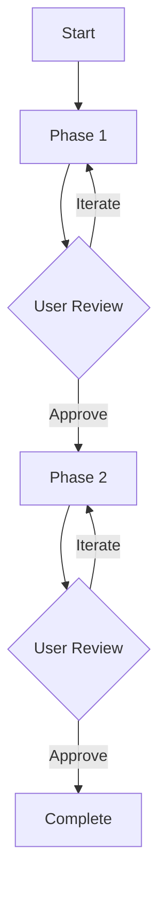

# Workflow Guide: Deep Dive into Systematic AI Collaboration

## Table of Contents

1. [Core Concepts](#core-concepts)
2. [Workflow Anatomy](#workflow-anatomy)
3. [Operating Modes](#operating-modes)
4. [Phase Management](#phase-management)
5. [Approval Gates](#approval-gates)
6. [Artifact System](#artifact-system)
7. [Knowledge Capture](#knowledge-capture)
8. [Advanced Patterns](#advanced-patterns)

---

## Core Concepts

### What is a Workflow Spec?

A workflow spec is a **structured prompt** that guides an AI agent through a systematic, phase-based process. Unlike ad-hoc prompts, workflow specs provide:

- **Explicit structure**: Clear phases with defined objectives
- **Approval gates**: User review and consent at each stage
- **Persistent artifacts**: Markdown documentation of all decisions
- **Professional standards**: Embedded best practices and methodologies
- **Learning systems**: Adaptation to user preferences over time

### The Systematic Approach

Traditional AI interaction:
```
User → Prompt → AI → Code/Response
```

Workflow-driven interaction:
```
User → Workflow Spec → AI Agent → Phase 1 → Approval → Phase 2 → Approval → ... → Complete Artifacts
                                      ↓           ↑
                                      └─ Feedback ┘
```

### Key Differences

| Aspect | Ad-Hoc AI | Workflow Specs |
|--------|-----------|----------------|
| **Process** | Reactive | Systematic |
| **Control** | Passive | Active |
| **Consistency** | Variable | Standardized |
| **Knowledge** | Lost | Captured |
| **Refinement** | Difficult | Built-in |
| **Quality** | Unpredictable | Professional |

---

## Workflow Anatomy

Every workflow spec contains these essential sections:

### 1. Workflow Mode System

Defines how the workflow operates:

**Collaboration Mode** (Default)
- Stepwise execution with approval gates
- Interactive feedback and iteration
- User-controlled progression

**Silent Mode** (User-triggered)
- Autonomous execution from start to finish
- Assumptions recorded in notepad
- No approval requests

### 2. Goal Statement

Clear articulation of what the workflow accomplishes:

```toml
## Goal
You are an agent that specializes in [domain]. You help [users] 
accomplish [objectives] through [methodology].
```

### 3. Agent Mindset

Philosophical approach and desired qualities:

```toml
## Agent Mindset and Capabilities
**[Quality] Excellence:**
- Approach [aspect] with [perspective]
- Consider [factors] across [scope]
```

**Examples:**
- `spec.toml`: "Requirements Rigor" - Treating specs as contracts
- `investigate.toml`: "Forensic Precision" - Evidence-based investigation
- `learn.toml`: "Educational Scaffolding" - Just-in-time learning support

### 4. Workflow Definition

The systematic process broken into phases:

```toml
### Phase 1: [Name]
**Objective:** [What this phase accomplishes]

**Constraints:**
- The model MUST create '.lia/[type]/{task_name}/1-[phase].md'
- The model MUST [specific requirements]
- The model MUST ask user to review and approve before proceeding

[Detailed guidance]
```

### 5. Workflow Diagram

Visual representation using Mermaid:



### 6. Execution Instructions

Critical constraints and requirements:

```toml
## IMPORTANT EXECUTION INSTRUCTIONS
- The model MUST NOT skip phases
- The model MUST wait for explicit approval
- The model MUST create all required artifacts
```

### 7. Notepad Template

Standard structure for knowledge capture:

```markdown
## 🧠 Key Insights & Discoveries
## 🔧 Technical Notes & Implementation Details
## 💡 Ideas & Future Enhancements
## 🔗 Cross-[Domain] Connections
## 📝 User Notes
## 🤖 LLM Observations
```

---

## Operating Modes

### Collaboration Mode (Default)

**When to Use:**
- Learning new concepts
- Complex or ambiguous requirements
- High-stakes decisions
- First time using a workflow
- When iteration is valuable

**How it Works:**
1. AI completes Phase 1, creates artifact
2. AI presents results and asks for approval
3. User reviews:
   - Approve → Proceed to Phase 2
   - Iterate → AI refines based on feedback
   - Go back → Revise earlier phases
4. Repeat for each phase

**Example Interaction:**
```
AI: I've drafted the requirements document with 5 user stories and 
    acceptance criteria in EARS format. The requirements focus on...
    
    Would you like to review the requirements? Any changes needed?

User: Add a requirement for OAuth support

AI: I've added Requirement 6 for OAuth 2.0 authentication including
    Google and GitHub providers. Here's the updated section...
    
    Does this look good now?

User: Perfect, approved

AI: Great! Moving to Phase 2: Design Document...
```

### Silent Mode (User-Triggered)

**When to Use:**
- Routine or well-understood tasks
- Time constraints
- Batch processing
- High confidence in approach
- When you trust the AI's judgment

**How to Activate:**
- "Run in silent mode"
- "Execute silently"
- "Autonomous execution"
- "Complete all phases without approval"

**How it Works:**
1. AI completes all phases sequentially
2. Makes assumptions when user input would be needed
3. Records all assumptions in 0-notepad.md
4. Presents complete artifact set at the end

**Example Interaction:**
```
User: Create a spec for user authentication - run in silent mode

AI: [Executes all phases]

    I've completed the full specification workflow for user 
    authentication. Here's what was created:
    
    📁 .lia/specs/user-authentication/
    ├── 0-notepad.md (including assumptions made)
    ├── 1-requirements.md (8 requirements with EARS format)
    ├── 2-design.md (JWT-based architecture)
    └── 3-tasks.md (15 implementation tasks)
    
    Key assumptions recorded in notepad:
    - Assumed JWT tokens over session-based auth
    - Assumed bcrypt for password hashing
    - Assumed 15-minute token expiry
    
    Review the artifacts and let me know if any adjustments needed.
```

---

## Phase Management

### Phase Structure

Each phase has:

1. **Clear Objective** - Single, focused purpose
2. **Deliverable** - Specific artifact to create
3. **Constraints** - MUST/SHOULD/MAY requirements
4. **Approval Gate** - Mandatory user review

### Phase Progression

```
Phase N Complete → Present Results → Request Approval
                                           ↓
                    ┌─────────────────────────────────────┐
                    ↓                                      ↓
            User: "Iterate"                        User: "Approved"
                    ↓                                      ↓
            Refine Phase N                          Phase N+1
```

### Phase Dependencies

Most workflows have sequential dependencies:

**spec.toml Example:**
- Phase 1 (Requirements) informs Phase 2 (Design)
- Phase 2 (Design) informs Phase 3 (Tasks)
- Phase 3 (Tasks) references Phase 1 (Requirements)

Cannot skip because:
- Design needs requirements to be concrete
- Tasks need design to be implementable
- Traceability requires all phases

### Phase Iteration

Iteration is **encouraged** within phases:

**Good Iteration Examples:**
- "Add OAuth to requirements"
- "Change database from MongoDB to PostgreSQL"
- "Split this task into smaller subtasks"
- "Clarify the acceptance criteria for Requirement 3"

**When to Iterate vs Move Forward:**
- Iterate: Something is missing or incorrect
- Move forward: Good enough, can refine later
- Go back: Need to revise earlier phase first

---

## Approval Gates

### Purpose

Approval gates ensure:
- User maintains control
- Decisions are explicit
- Quality is maintained
- Alignment is verified
- Learning happens

### Approval Language

**Approve:**
- "Approved"
- "Looks good"
- "Yes, proceed"
- "Continue"
- "Perfect"

**Iterate:**
- "Add [X]"
- "Change [Y]"
- "Clarify [Z]"
- "Can you explain [W]?"
- "Consider [V]"

**Go Back:**
- "Go back to requirements"
- "Revise Phase 1"
- "Restart from design"

### Approval Best Practices

**Don't rush:**
- Take time to review
- Ask questions
- Request alternatives
- Challenge assumptions

**Be specific:**
- ❌ "This doesn't look right"
- ✅ "Change authentication from sessions to JWT"

**Use the process:**
- Early feedback is cheap
- Later changes are expensive
- Approval gates prevent costly mistakes

---

## Path Variables

### Understanding ${WORKSPACE}

Workflow specs reference documentation using portable path patterns:

```
${WORKSPACE}/docs/ or ./docs/
```

**What ${WORKSPACE} means:**
- `${WORKSPACE}` - The root directory of your project/workspace
- `./docs/` - Relative path fallback for local execution

**When to use each:**
| Context | Path to Use |
|---------|-------------|
| Global installation | `${WORKSPACE}/docs/` resolves to your workspace root |
| Local/project install | `./docs/` resolves relative to current directory |
| MCP server | Set via `LIA_SPECS_DIR` environment variable |

**Common Referenced Paths:**
- `${WORKSPACE}/docs/` - Main documentation folder
- `${WORKSPACE}/docs/development/blueprint-1/phase-1/new-implementations/` - New feature docs
- `${WORKSPACE}/docs/development/blueprint-1/phase-1/proposals-for-review/` - Proposals awaiting review

---

## Artifact System

### Artifact Structure

Every workflow creates:

```
.lia/{workflow_type}/{task_name}/
├── 0-notepad.md          # Always created first
├── 1-{phase1}.md         # Phase 1 deliverable
├── 2-{phase2}.md         # Phase 2 deliverable
└── ...                   # Additional phases
```

### Artifact Types

**0-notepad.md** (Universal)
- Insights and discoveries
- Technical notes
- Ideas for future work
- Cross-system connections
- User and AI observations

**Requirements.md** (spec.toml)
- User stories
- Acceptance criteria (EARS format)
- Constraints and assumptions

**Design.md** (spec.toml, architecture.toml)
- Architectural decisions
- Component diagrams
- Data models
- Technology choices

**Tasks.md** (spec.toml, dev.toml)
- Implementation checklist
- Requirement traceability
- Priority and dependencies

### Artifact Persistence

Artifacts are:
- **Version controlled** - Track changes over time
- **Markdown formatted** - Human and AI readable
- **Project scoped** - Organized by task
- **Referenceable** - Link between artifacts
- **Evolvable** - Update as project progresses

### Artifact Usage

**During development:**
```bash
# Reference during implementation
cat .lia/specs/user-auth/3-tasks.md

# Check design decisions
cat .lia/specs/user-auth/2-design.md

# Review captured insights
cat .lia/specs/user-auth/0-notepad.md
```

**For documentation:**
- Source material for user guides
- Architecture decision records
- Project history and context

**For learning:**
- Review past decisions
- Understand rationale
- Build institutional knowledge

---

## Knowledge Capture

### The 0-Notepad Pattern

Every workflow creates `0-notepad.md` as the first artifact. This captures:

**🧠 Key Insights & Discoveries**
- Unexpected findings
- Pattern recognition
- "Aha!" moments
- Decision rationale

**🔧 Technical Notes**
- Implementation constraints
- Performance considerations
- Security implications
- Integration challenges

**💡 Ideas & Future Enhancements**
- Version 2 features
- Optimization opportunities
- Alternative approaches
- Related innovations

**🔗 Cross-System Connections**
- Dependencies
- Integration points
- Related systems
- Architectural impacts

**📝 User Notes**
- User-added observations
- Requirements from stakeholders
- Constraints from other teams
- Business context

**🤖 LLM Observations**
- Patterns in user decisions
- Preferences detected
- Suggestions based on history
- Learning for future interactions

### Why Capture Knowledge?

**Prevents Loss:**
- Discussions are preserved
- Rationale is documented
- Context is maintained

**Enables Learning:**
- Review past decisions
- Understand what worked
- Build expertise over time

**Facilitates Collaboration:**
- Team members see reasoning
- New members get context
- Stakeholders understand decisions

### Knowledge Evolution

Notepad grows throughout workflow:

```
Phase 1: Initial insights about requirements
Phase 2: Design considerations and tradeoffs
Phase 3: Implementation notes and challenges
Phase N: Accumulated knowledge across workflow
```

---

## Advanced Patterns

### Pattern 1: Workflow Chaining

Combine workflows for complex projects:

```
research.toml → spec.toml → dev.toml → test.toml
(Evaluate)     (Design)     (Build)     (Validate)
```

**Example:**
1. **research.toml**: Evaluate authentication libraries
2. **spec.toml**: Design auth system
3. **dev.toml**: Implement with TDD
4. **test.toml**: Comprehensive test suite

### Pattern 2: Iterative Refinement

Use workflows to continuously improve:

```
review.toml → optimize.toml → test.toml → review.toml
(Assess)       (Improve)       (Validate)   (Re-assess)
```

### Pattern 3: Knowledge Building

Build persistent knowledge repositories:

**learn.toml** creates:
```
@Learning/
├── concepts/
├── projects/
└── skills/
```

**paper.toml** creates:
```
@Research/
├── papers/
├── knowledge_graph/
└── citation_network/
```

### Pattern 4: Parallel Workflows

Run multiple workflows for different aspects:

```
Team Member A: architecture.toml (system design)
Team Member B: security.toml (security review)
Team Member C: docs.toml (documentation)
```

Then converge for integration.

### Pattern 5: Domain Specialization

Fork and customize specs:

```toml
# medical-device-review.toml
[extends]
base = "specs/quality/review.toml"

[additional_phases]
7.5 = "Medical Device Compliance"
  • ISO 13485 requirements
  • FDA 21 CFR Part 11
  • Risk management per ISO 14971
```

---

## Best Practices

### 1. Choose the Right Workflow

Match workflow to need:
- **spec.toml**: New features
- **troubleshoot.toml**: Bugs
- **wtf.toml**: Understanding existing code
- **learn.toml**: Learning while building

### 2. Embrace Iteration

Don't settle for first draft:
- Requirements improve with refinement
- Design benefits from exploration
- Tasks clarify with detail

### 3. Use Silent Mode Appropriately

Silent mode for:
- ✅ Routine tasks
- ✅ Batch operations
- ✅ Well-understood domains

Not for:
- ❌ Learning situations
- ❌ High-stakes decisions
- ❌ Ambiguous requirements

### 4. Maintain Artifacts

- Commit to version control
- Update as project evolves
- Reference in discussions
- Share with team

### 5. Leverage Knowledge Capture

- Add your own notes to notepad
- Review insights periodically
- Build team knowledge base
- Learn from past projects

---

## Troubleshooting

### "AI isn't following the workflow"

**Solution:** Be explicit:
```
"Please follow the spec.toml workflow exactly, including all 
phases and approval gates. Do not skip or combine steps."
```

### "Workflow feels too slow"

**Options:**
1. Use silent mode for straightforward parts
2. Approve quickly when comfortable
3. Combine with earlier iteration

### "I want to change an earlier phase"

**Solution:** Just ask:
```
"Let's go back to requirements and add OAuth support"
```

Workflows support going back anytime.

### "Output doesn't match my expectations"

**Solution:** Iterate:
```
"Change the database from PostgreSQL to MongoDB and 
update the design accordingly"
```

---

## Next Steps

- Read [Best Practices](best-practices.md) for patterns
- See [Examples](../examples/) for real usage
- Try [Getting Started](../GETTING_STARTED.md) tutorial
- Explore [Customization](customization.md) guide

---

**Master systematic AI collaboration and transform how you build software.**

